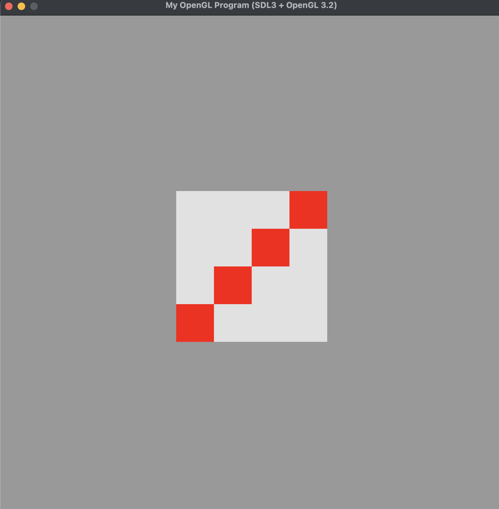
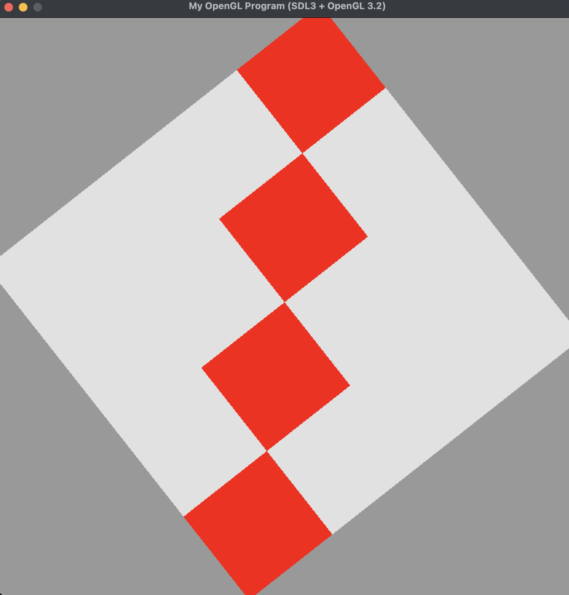

Here is the original picture

It can be translated to any location by clicking only inside the square.

It can be rotated by any angle by clicking near the edges.

The picture can be resized by taking its corners and drag it.

Here is a demo that I showed all the changes can be reset by pressing "r". 

The code can be run by this command on macOS: 
clang -c glad/glad.c -o build/glad.o
clang++ -std=c++17 -Wall squareStarter.cpp build/glad.o \
  -I /opt/homebrew/include -L /opt/homebrew/lib \
  -lSDL3 -framework OpenGL \
  -o square
./square
